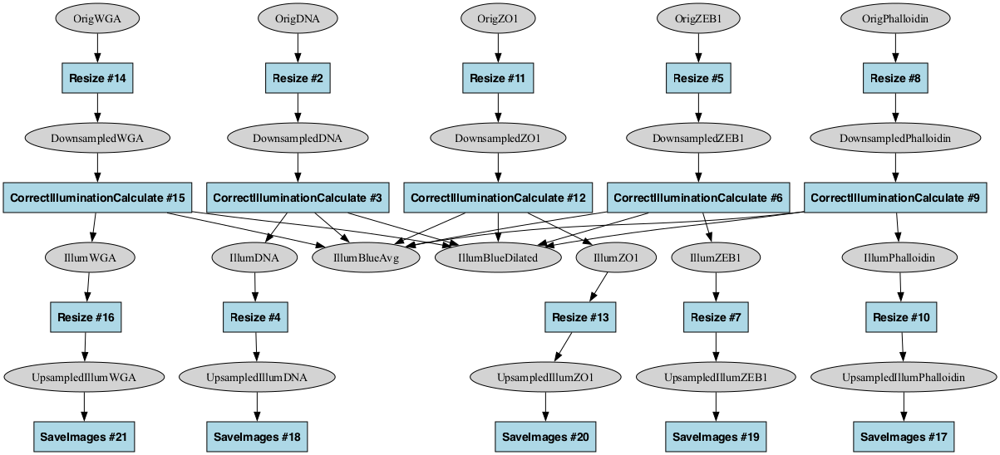

# CellProfiler Pipeline Graph Analysis Tool

This tool converts CellProfiler pipelines into standardized graph representations, focusing exclusively on image flow between modules. It enables precise comparison of pipeline image processing structures while deliberately excluding module settings and non-image outputs. By extracting only image dependencies from JSON pipeline files, it creates consistent, comparable representations optimized for detecting structural changes between pipeline versions.

## Core Functionality

- **Pipeline Comparison**: Generate consistent graph representations to detect functional differences between pipelines
- **Computational Analysis**: Convert pipeline structure to standard graph formats for programmatic analysis
- **Standardized Output**: Create canonical representations that ignore irrelevant differences (like module reordering)
- **Visualization**: View pipeline structure as a directed graph (a useful side benefit)

## Usage

```bash
python cp_graph.py <pipeline.json> [output_graph.graphml] [options]
```

- `pipeline.json` - Your CellProfiler pipeline file (v6 JSON format)
- `output_graph.graphml` - Optional output file (supports .graphml, .gexf, or .dot formats)

Options:
- `--no-formatting` - Strip all formatting information to focus on topology for comparison
- `--no-module-info` - Hide module information on graph edges
- `--include-disabled` - Include disabled modules in the graph (excluded by default)
- `--explain-ids` - Print mapping of stable node IDs to original module numbers

## Pipeline Comparison (Image Flow Focus)

### What This Tool Compares

This tool is intentionally narrowly scoped to analyze and compare:
- Which modules exist in the pipeline
- How images flow between modules
- The topological structure of image processing

It deliberately **does not compare**:
- Specific module parameter settings
- Non-image data (objects, measurements, CSV outputs)
- Module internal processing logic

### How Graph Standardization Works

1. **Stable Node Identification**:
   - Image nodes use their actual names from the pipeline (e.g., "OrigDNA")
   - Module nodes use a hash-based identifier that combines:
     - Module type (e.g., "Resize")
     - Alphabetically sorted list of input images
     - Alphabetically sorted list of output images
   - This ensures the same module functionality always gets the same identifier, regardless of pipeline ordering

2. **Consistent Serialization**:
   - When writing DOT files, nodes are sorted lexicographically by name
   - Edges are sorted by source node first, then destination node
   - This ensures the exact same file content for functionally equivalent pipelines

3. **Optional Formatting Removal**:
   - The `--no-formatting` option strips all visual styling
   - This focuses solely on the graph topology for comparison

### Comparison Capabilities

This standardization makes it possible to:

1. Compare two pipeline versions using simple file diff tools
2. Detect real functional changes vs. just module reordering
3. Create canonical representations of pipeline structure
4. Identify when two different-looking pipelines have identical data flows

```bash
# Generate stripped-down topology representations for two pipelines
python cp_graph.py pipeline1.json pipeline1.dot --no-formatting
python cp_graph.py pipeline2.json pipeline2.dot --no-formatting

# Compare using standard diff tools
diff pipeline1.dot pipeline2.dot
```

The combination of stable identifiers and consistent serialization ensures that any differences detected between two graph outputs represent actual changes in pipeline functionality, not just cosmetic or ordering differences.

## Technical Implementation

### What's Captured

The tool **focuses exclusively on image flow**, deliberately omitting other aspects of the pipeline. It extracts only two specific elements from each module:

1. Input images: `cellprofiler_core.setting.subscriber.image_subscriber._image_subscriber.ImageSubscriber`
2. Output images: `cellprofiler_core.setting.text.alphanumeric.name.image_name._image_name.ImageName`

For each enabled module, it creates:
- Nodes for each input and output image
- A node for the module itself with a stable, hash-based identifier
- Connections tracking the flow of images between modules

### Current Limitations

This tool deliberately excludes:

1. **Module Settings**: The specific parameters and configurations within each module are not captured, only their existence and image connections
2. **Non-Image Data Flow**: Other outputs such as CSV files, measurements, or object information are not represented
3. **Module Internal Logic**: Only the external inputs/outputs are captured, not the internal processing

These limitations are intentional to keep the graph focused on overall pipeline structure and image flow patterns.

### Stable Module Identifiers

To enable reliable pipeline comparisons even when modules are reordered, the tool generates stable module identifiers based on:
1. The module type (e.g., "Resize", "IdentifyPrimaryObjects")
2. A hash of its input and output image connections

This ensures that functionally equivalent modules have the same ID regardless of their position in the pipeline. Original module numbers from the pipeline are maintained in node labels for reference.

The `--explain-ids` option prints the mapping between stable IDs and the original module numbers.

## Additional Features

### Handling Disabled Modules

By default, the tool ignores modules that have `enabled: false` in their attributes, as these aren't actually executed in the pipeline. If you want to include disabled modules in your graph, use the `--include-disabled` flag.

### Example Commands

```bash
# Basic comparison-ready output (no formatting, focused on topology)
python cp_graph.py 1_CP_Illum.json 1_CP_Illum_graph.dot --no-formatting

# Include disabled modules
python cp_graph.py 1_CP_Illum.json 1_CP_Illum_graph.dot --include-disabled

# Show stable module ID mapping (useful for debugging)
python cp_graph.py 1_CP_Illum.json 1_CP_Illum_graph.dot --explain-ids
```

## Visualization (Secondary Feature)

While the primary purpose is computational analysis and comparison, the tool also supports visualization:

### Visual Styling

The graph visually represents different elements:

- **Images**: Gray ovals 
- **Processing Modules**: Blue boxes with the module name and number
- **Disabled Modules**: Pink boxes with dashed borders (when included)
- **Connections**: Arrows showing the flow between images and modules

### Rendering the Graph

If you have Graphviz installed, you can render a DOT file to an image:

```bash
dot -Tpng 1_CP_Illum_graph.dot -o 1_CP_Illum_graph.png
```



The generated files can also be opened with:
- GraphML (.graphml): yEd, Cytoscape, or other graph visualization software
- GEXF (.gexf): Gephi
- DOT (.dot): Graphviz, OmniGraffle

## Requirements

- Python 3.x
- NetworkX library
- PyDot (optional, for DOT output)

Install dependencies with:

```bash
pip install networkx pydot
```