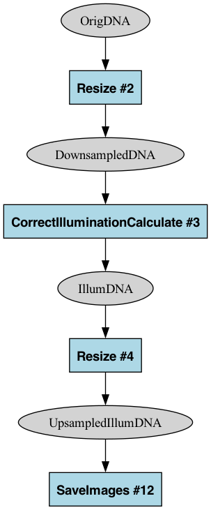
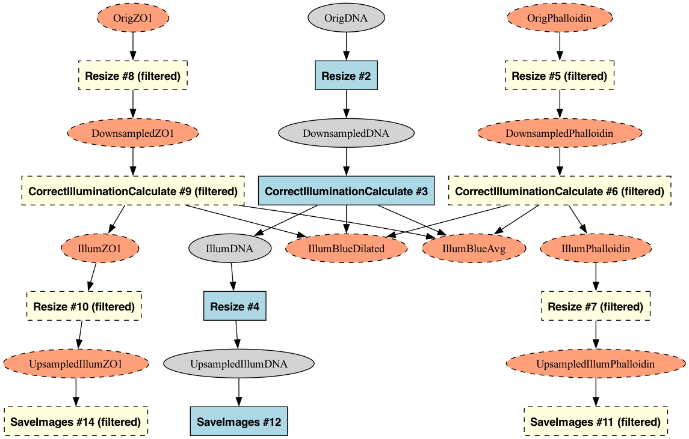

# CellProfiler Pipeline Graph Analysis Tool

This tool converts CellProfiler pipelines into standardized graph representations to analyze data flow between modules. It enables precise comparison of pipeline structures while deliberately excluding module settings. The tool tracks multiple data types (images, objects, lists) using a unified representation optimized for detecting structural changes between pipeline versions.

## Core Functionality

- **Pipeline Comparison**: Generate consistent graph representations to detect functional differences between pipelines
- **Unified Data Flow**: Track all data types (images, objects, lists) in a single comprehensive view
- **Computational Analysis**: Convert pipeline structure to standard graph formats for programmatic analysis
- **Standardized Output**: Create canonical representations that ignore irrelevant differences (like module reordering)
- **Visualization**: View pipeline structure as a directed graph with intuitive color coding

## Usage

```bash
# Run with regular Python
python cp_graph.py <pipeline.json> <output_file> [options]

# Run with UV to automatically install dependencies (recommended)
uv run --script cp_graph.py <pipeline.json> <output_file> [options]
```

- `pipeline.json` - Your CellProfiler pipeline file (v6 JSON format)
- `output_file` - Output file path (supports .graphml, .gexf, or .dot formats)

Options:

**Display Options:**
- `--no-formatting` - Strip all formatting information to focus on topology for comparison
- `--no-module-info` - Hide module information on graph edges
- `--ultra-minimal` - Create minimal output with only essential structure for exact diff comparison
- `--explain-ids` - Print mapping of stable node IDs to original module numbers

**Content Filtering Options:**
- `--include-disabled` - Include disabled modules in the graph (excluded by default)
- `--root-nodes=<name1,name2>` - Filter to keep only paths from specified root nodes
- `--remove-unused-images` - Remove image nodes not used as inputs
- `--highlight-filtered` - Highlight nodes that would be filtered instead of removing them

## Pipeline Comparison

### Scope and Limitations

This tool is designed to analyze and compare:
- Which modules exist in the pipeline
- How data (images, objects, lists) flows between modules
- The topological structure of data processing

It deliberately excludes:
- Specific module parameter settings
- Measurement outputs and CSV data
- Module internal processing logic

These limitations are intentional to keep the graph focused on overall pipeline structure and data flow patterns.

### How Graph Standardization Works

1. **Stable Module Identifiers**:
   - Data nodes use their actual names with type prefixes (e.g., "image__OrigDNA", "object__Nuclei")
   - Module nodes use a hash-based identifier that combines:
     - Module type (e.g., "Resize")
     - Alphabetically sorted list of all inputs with their types
     - Alphabetically sorted list of all outputs with their types
   - This ensures the same module gets the same identifier regardless of pipeline ordering
   - Original module numbers are maintained in node labels for reference

2. **Consistent Serialization**:
   - Nodes are sorted lexicographically when writing files
   - Edges are sorted by source node first, then destination node
   - This creates identical file content for functionally equivalent pipelines

3. **Unified Data Representation**:
   - Extracts and normalizes multiple data types:
     - Images: `ImageSubscriber` (input) and `ImageName` (output)
     - Objects: `LabelSubscriber` (input) and `LabelName` (output)
     - Lists: `ImageListSubscriber` and `LabelListSubscriber` (inputs)
   - Uses a unified node representation while preserving connection semantics
   - Edge types maintain information about how modules connect to data
   - Provides the `--explain-ids` option to show mapping between stable IDs and original numbers

### Comparison Capabilities

This approach makes it possible to:

1. Compare two pipeline versions using simple file diff tools
2. Detect real functional changes vs. just module reordering
3. Create canonical representations of pipeline structure

### Detection of Structural Equivalence and Differences

The tool excels at two critical comparison tasks:

1. **Confirming Structural Equivalence** 

   When comparing `illum.json` with `illum_isoform.json` (identical structure but different module numbering):
   
   ```bash
   python cp_graph.py examples/illum.json examples/output/illum_ultra.dot --ultra-minimal
   python cp_graph.py examples/illum_isoform.json examples/output/illum_isoform_ultra.dot --ultra-minimal
   diff examples/output/illum_ultra.dot examples/output/illum_isoform_ultra.dot
   ```
   
   This produces no output, confirming the two pipelines are structurally identical despite their different module numbering.

2. **Detecting Real Functional Differences**

   When comparing `illum.json` with `illum_mod.json` (where a SaveImages module is disabled):
   
   ```bash
   python cp_graph.py examples/illum.json examples/output/illum_ultra.dot --ultra-minimal
   python cp_graph.py examples/illum_mod.json examples/output/illum_mod_ultra.dot --ultra-minimal
   diff examples/output/illum_ultra.dot examples/output/illum_mod_ultra.dot
   ```
   
   This reveals the actual structural differences:
   
   ```diff
   12d11
   < SaveImages_46180921 [type=module];
   54d52
   < image__UpsampledIllumZO1 -> SaveImages_46180921;
   ```
   
   This clearly shows the missing SaveImages module and its connection, despite all visual noise from module numbering being removed.


## Additional Features

### Handling Disabled Modules

By default, the tool ignores modules with `enabled: false` in their attributes. Use the `--include-disabled` flag to include these modules in your graph (shown with pink background and dashed borders).

### Filtering and Highlighting

The tool provides several filtering options to focus on specific parts of the pipeline:

- **Root Node Filtering**: Use `--root-nodes=<name1,name2>` to keep only paths reachable from specified root nodes. This is useful for focusing on a specific data flow path in complex pipelines.

- **Unused Image Removal**: Use `--remove-unused-images` to remove image nodes that aren't used as inputs to any module.

- **Highlighting vs. Removing**: When using filters, you can either:
  - Remove filtered nodes (default behavior)
  - Highlight them visually with `--highlight-filtered` to see what would be filtered out

The highlight mode is especially useful when exploring a pipeline to understand which parts would be affected by filters before actually removing them.

#### Example: Highlighting vs. Filtering

```bash
# Generate a filtered graph (removes unreachable nodes)
python cp_graph.py examples/illum.json examples/output/illum_filtered.dot --root-nodes=OrigDNA --remove-unused-images

# Generate a highlighted graph (keeps but highlights unreachable nodes)
python cp_graph.py examples/illum.json examples/output/illum_highlight.dot --root-nodes=OrigDNA --remove-unused-images --highlight-filtered
```

 

### Example Files & Commands

The repository is structured with:
- `examples/` - Sample CellProfiler pipeline files:
  - `illum.json` - Basic illumination correction pipeline
  - `illum_isoform.json` - Structurally identical to `illum.json` but with different module numbering
  - `illum_mod.json` - Modified illumination pipeline with a disabled SaveImages module
  - `analysis.json` - More complex pipeline demonstrating various data types
- `examples/output/` - Pre-generated graph outputs for reference

Below are example commands showing common usage patterns:

```bash
# Basic illumination pipeline example
python cp_graph.py examples/illum.json examples/output/illum.dot

# Basic visualization
dot -Tpng examples/output/illum.dot -o examples/output/illum.png

# Additional illumination pipeline options
python cp_graph.py examples/illum.json examples/output/illum_no_format.dot --no-formatting
python cp_graph.py examples/illum.json examples/output/illum_disabled.dot --include-disabled
python cp_graph.py examples/illum.json examples/output/illum_ids.dot --explain-ids

# Analyze complex pipeline
python cp_graph.py examples/analysis.json examples/output/analysis.dot

# Generate visualization for complex pipeline
dot -Tpng examples/output/analysis.dot -o examples/output/analysis.png

# Ultra-minimal mode for pipeline comparison
python cp_graph.py examples/illum.json examples/output/illum_ultra.dot --ultra-minimal
python cp_graph.py examples/illum_mod.json examples/output/illum_mod_ultra.dot --ultra-minimal

# Filtering options
python cp_graph.py examples/illum.json examples/output/illum_filtered.dot --root-nodes=OrigDNA
python cp_graph.py examples/illum.json examples/output/illum_highlight.dot --root-nodes=OrigDNA --highlight-filtered
```

## Visualization

While the primary purpose is computational analysis and comparison, the tool provides rich visualization capabilities:

### Visual Styling

The graph visually represents different elements with consistent styling:

- **Images**: Gray ovals
- **Objects**: Green ovals
- **Processing Modules**: Blue boxes with the module name and number
- **Disabled Modules**: Pink boxes with dashed borders (when included)
- **Filtered Nodes**: Yellow (modules) or salmon (data) with dashed borders (when using `--highlight-filtered`)
- **Connections**: Arrows showing the flow between data nodes and modules

For exact byte-for-byte consistency in file comparisons, use the `--ultra-minimal` option which excludes styling attributes entirely.

### Comprehensive Pipeline Visualization

The complex analysis pipeline demonstrates how the tool handles multiple data types in a unified visualization:


This visualization shows:
- Multiple data types (images in gray, objects in green)
- All data relationships and module processing flow
- Standardized representation optimized for analysis and comparison

The generated files can be opened with:
- Graphviz: `dot -Tpng examples/output/analysis.dot -o examples/output/analysis.png`
- GraphML (.graphml): yEd, Cytoscape
- GEXF (.gexf): Gephi

## Requirements

- Python 3.11+
- NetworkX library
- PyDot (for DOT output)
- Click (for CLI interface)

Install dependencies with:

```bash
pip install networkx pydot click
```

Or use UV (recommended):

```bash
uv pip install networkx pydot click
```